# PDV - Ponto de Venda v1.0

> Este projeto nasceu de uma necessidade real: ajudar um pequeno comércio próximo a mim. O que começou como um exercício prático se tornou um sistema completo de Ponto de Venda, desenvolvido em Java com Spring Boot, pensado para comerciantes de pequeno e médio porte.

> O PDV cobre todo o fluxo de uma venda — do cadastro de produtos ao fechamento do caixa — com suporte a impressoras térmicas, leitores de código de barras e exportação de dados.
---

## 📋 Visão Geral

| Campo | Valor |
| --- | --- |
| Status | ✅ V1.0 Concluído |
| Início | 02/12/2025 |
| Finalização | 12/03/2026 |
| Repositório | [GitHub](https://github.com/c0mcod/PDV_API) |
| Porta local | `Definido em variável de ambiente` |

---

## 🛠️ Tecnologias

| Tecnologia | Versão | Para que usa |
| --- | --- | --- |
| Java | 17 | Linguagem principal |
| Spring Boot | 3.2.5 | Framework web |
| MySQL | 8.x | Banco de dados |
| Spring Data JPA | 3.2.5 | Acesso ao banco |
| Hibernate | 6.4.4.Final | ORM |
| Maven | 4.0.0 | Gerenciador de dependências |

---

## ▶️ Como rodar

### Pré-requisitos

- Java 17+
- MySQL rodando
- Maven instalado

### Passo a passo

```bash
git clone https://github.com/c0mcod/PDV_API
cd PDV_API
mvn spring-boot:run
```

### application.properties

```properties
spring.datasource.url=jdbc:mysql://localhost:3306/nome_do_banco
spring.datasource.username=SEU_USUARIO
spring.datasource.password=SUA_SENHA
spring.jpa.hibernate.ddl-auto=update
```

---

## 📝 Diagramas

### 🎨 DER

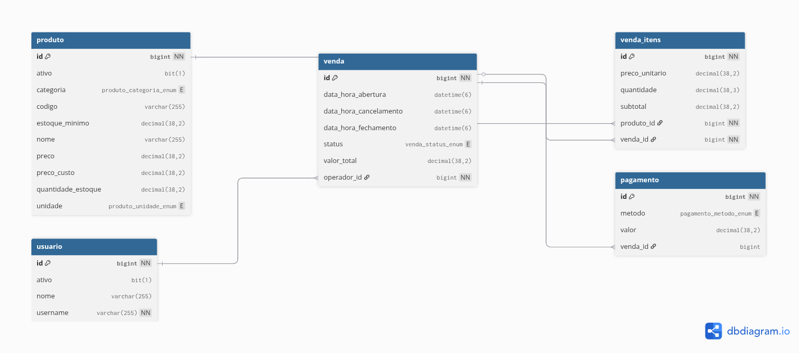

### 📐 UML

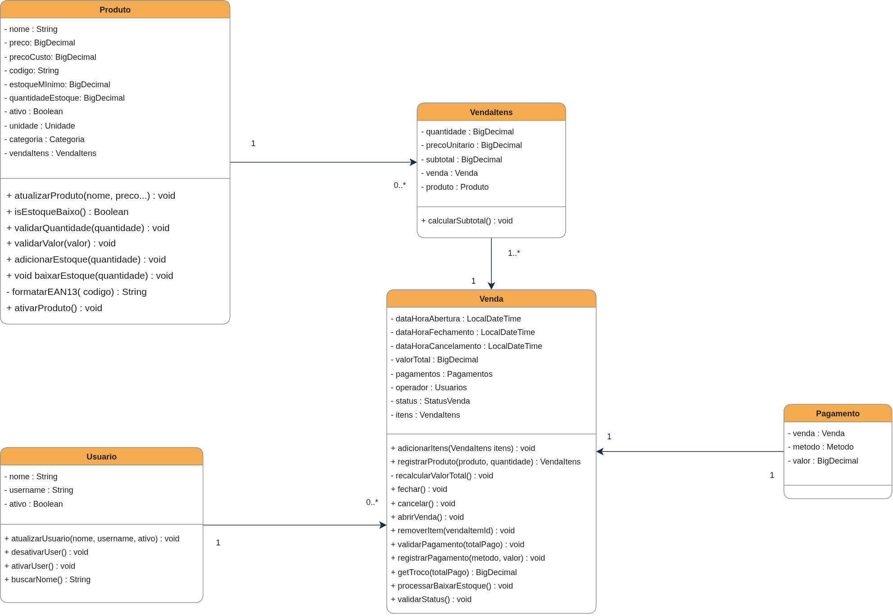

---

## 🔗 Endpoints

O mapeamento completo de cada endpoint e DTOs está automaticamente registrado pelo `Swagger UI`. Você pode consultá-lo em [http://localhost:8080/swagger-ui/index.html](http://localhost:8080/swagger-ui/index.html) quando subir o projeto localmente.

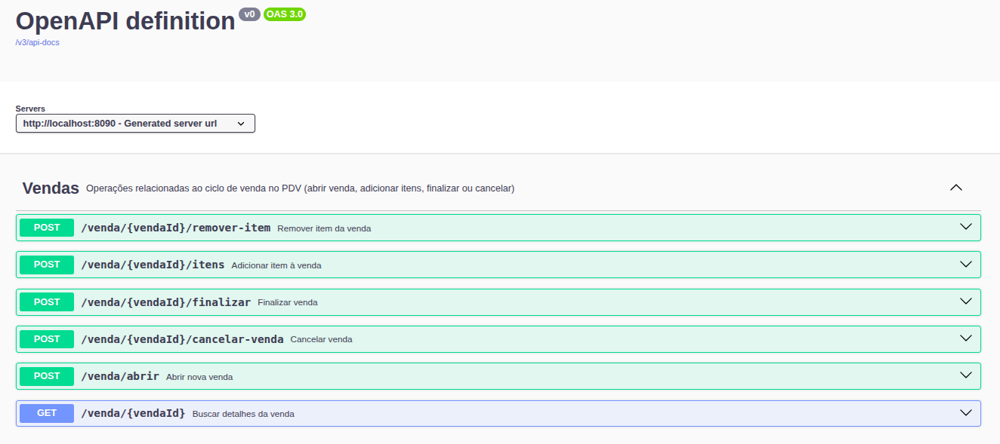

Aqui será possível analisar a resposta/envio de cada endpoint e o seu objetivo no sistema.

---

## 🏗️ Arquitetura

```
Controller  →  Service  →  Repository  →  Banco de Dados
(HTTP)         (Regras)     (Queries)       (MySQL)
```

### Responsabilidade de cada camada

| Camada | Pacote | Responsabilidade |
| --- | --- | --- |
| Controller | `controller/` | Recebe requisições HTTP, chama o Service |
| Service | `service/` | Contém as regras de negócio |
| Repository | `repository/` | Faz as queries no banco |
| Entities | `entities/` | Representa as tabelas do banco |

---

## 📝 Anotações / Decisões técnicas

### 1° Utilização de BigDecimal ao invés de double

O uso de `BigDecimal` é essencial. O [BigDecimal](https://docs.oracle.com/javase/8/docs/api/java/math/BigDecimal.html) é uma classe da biblioteca padrão `java.math`. Foi criada para precisão decimal exata, algo muito utilizado em sistemas financeiros. Algumas de suas vantagens em relação ao `double` são: precisão arbitrária, imutabilidade e operações aritméticas realizadas por métodos.

Claro, o `BigDecimal` é mais lento comparado ao `double`, mas no meu caso é necessária a confiabilidade que ele traz.

### 2° DDD (Domain-Driven Design)

[DDD](https://www.oreilly.com/library/view/domain-driven-design-tackling/0321125215/) é uma abordagem de modelagem de software focada no **domínio do negócio**. A ideia central é que o código represente fielmente as regras e conceitos do problema que o sistema resolve.

Obviamente não consegui (ainda) aplicar todos os conceitos e metodologias que o DDD propõe, mas tentei ao máximo organizar meu código para aplicá-lo de maneira limpa e torná-lo compreensível.

### 3° Diagramação UML e planejamento antes da prática

UML (Unified Modeling Language) é uma linguagem visual usada para modelar sistemas de software. Não é código; é uma forma padronizada de representar estruturas e comportamentos do sistema.

Se eu tivesse tirado 1 ou 2 dias para planejamento e diagramação do sistema, não teria cometido erros que fizeram esse projeto ser adiado várias vezes. É um aprendizado que levo para o resto da minha vida. Programar é de fato a parte mais fácil depois que você pega o jeito — pensar e arquitetar o funcionamento do sistema é bem mais difícil, mas é essencial para manter a qualidade.

---

## ✅ Funcionalidades

### Gerenciamento de Estoque

- CRUD de produtos
- Exportação de produtos cadastrados
- Ativação/desativação de produtos
- Status dinâmico com base na quantidade em estoque
- Registro de entrada de mercadoria
- Categorias diversificadas
- Busca por nome, código e categoria
- Stats rápidos de informações úteis

### Relatórios/Dashboard *(calculado por período predefinido ou personalizado)*

- Faturamento — *Preço do produto × Quantidade vendida*
- Lucro Bruto — Faturamento − CMV (Custo do produto × Quantidade vendida)
- Ticket Médio — Faturamento total / Número de vendas
- Produtos vendidos no período
- Top 5 produtos mais vendidos
- Vendas por dia da semana
- Vendas por categoria
- Resumo do estoque

### Operadores

- CRUD simples
- Ativo/inativo
- Filtro por status
- Busca por nome e identificador

### Histórico de Vendas

- Busca de vendas por período personalizado
- Detalhes de venda contendo: ID, data/hora de abertura e fechamento, lista de produtos, total e lista de pagamentos
- Filtro por operador
- Exportação `.xlsx` com estilo predefinido do período selecionado
- Stats rápidos: total de vendas do período, ticket médio e valor total

### PDV - Ponto de Venda

- Início rápido de venda
- Seleção de operador
- Quantidade unitária ou fracionada
- Seleção por código de produto
- Remoção de itens
- Exibição clara do produto, quantidade e subtotal
- Modal com exibição do valor total a pagar
- Validação de pagamento e exibição de troco
- Registro de pagamentos múltiplos
- Cancelamento de venda

---

## 🖼️ Layout do sistema

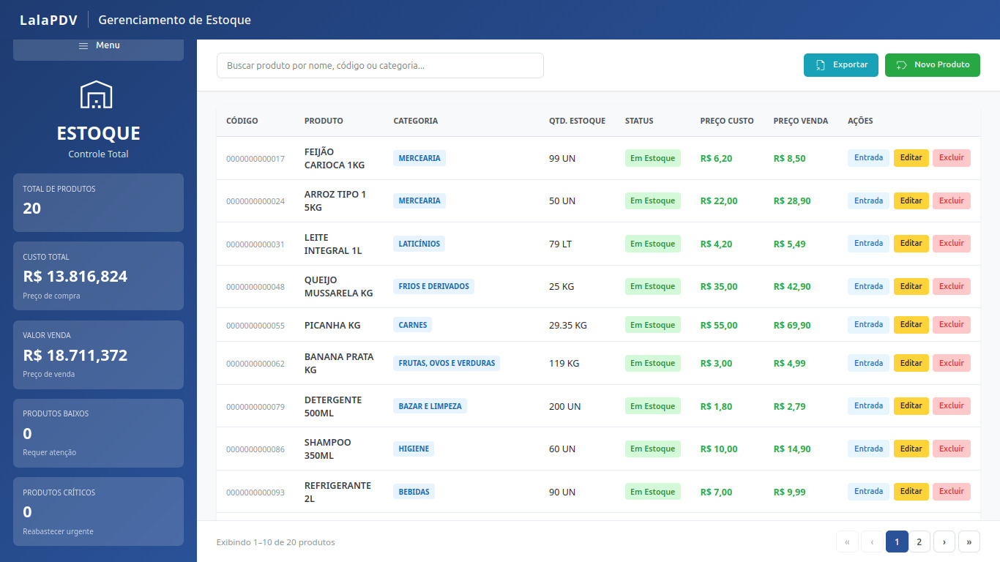
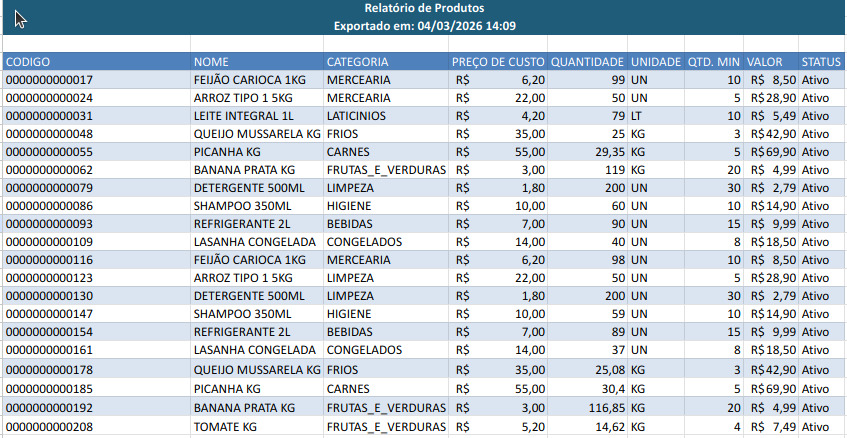
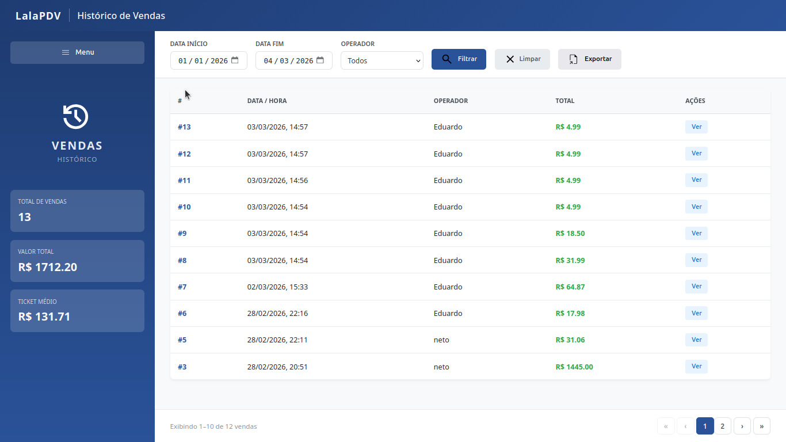
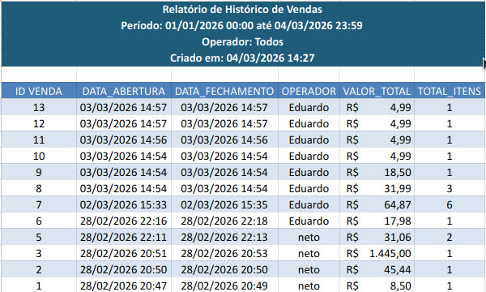
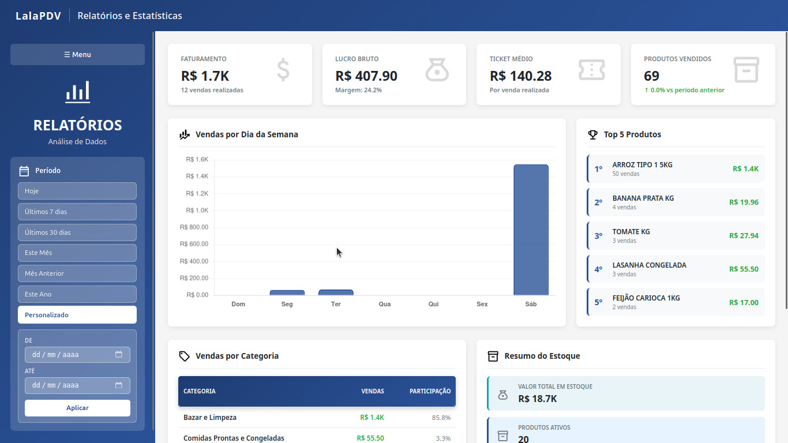
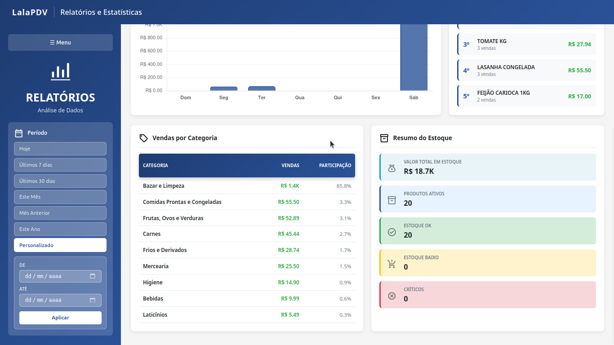
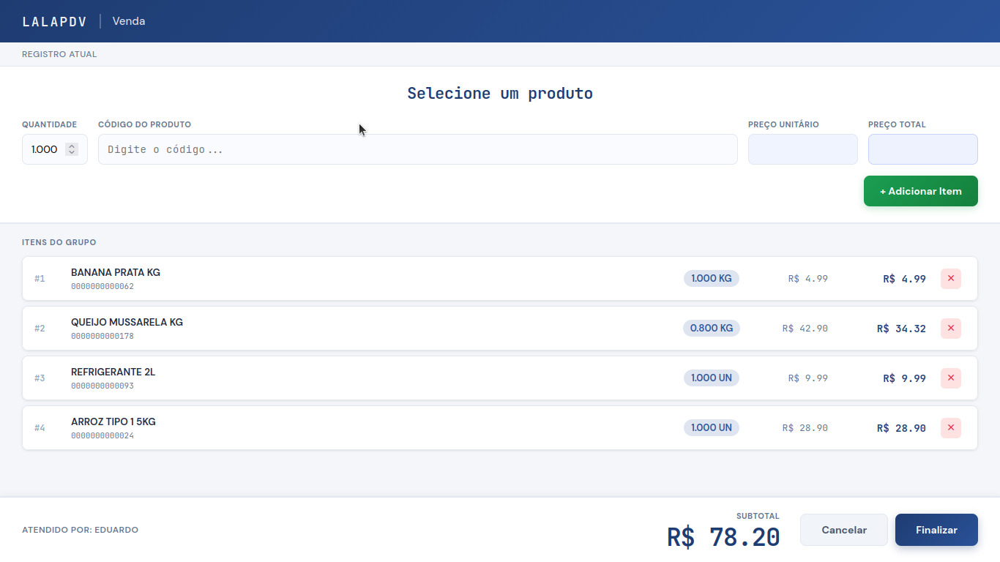
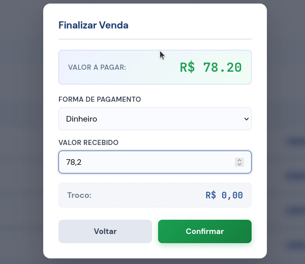
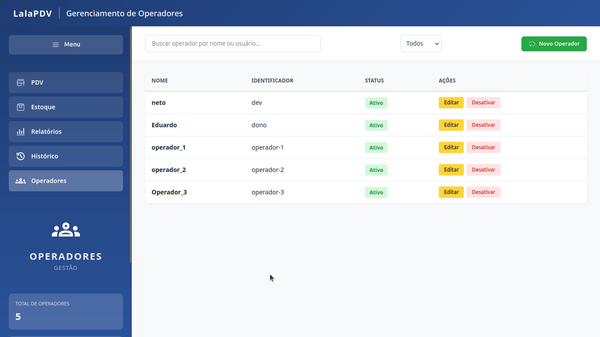


---

## 👤 Autor

Feito por **Antônio Carlos (c0mcod)** — [GitHub](https://github.com/c0mcod)